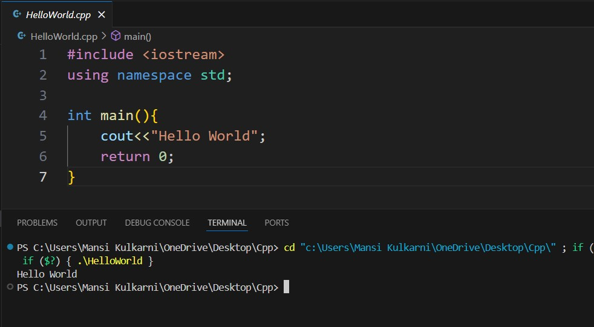
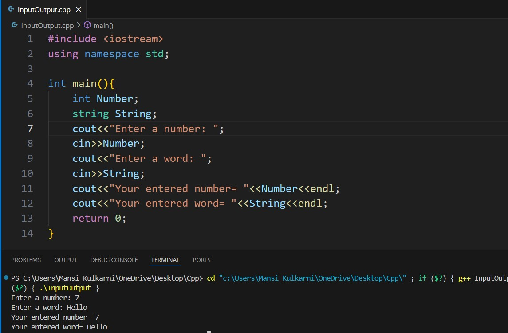
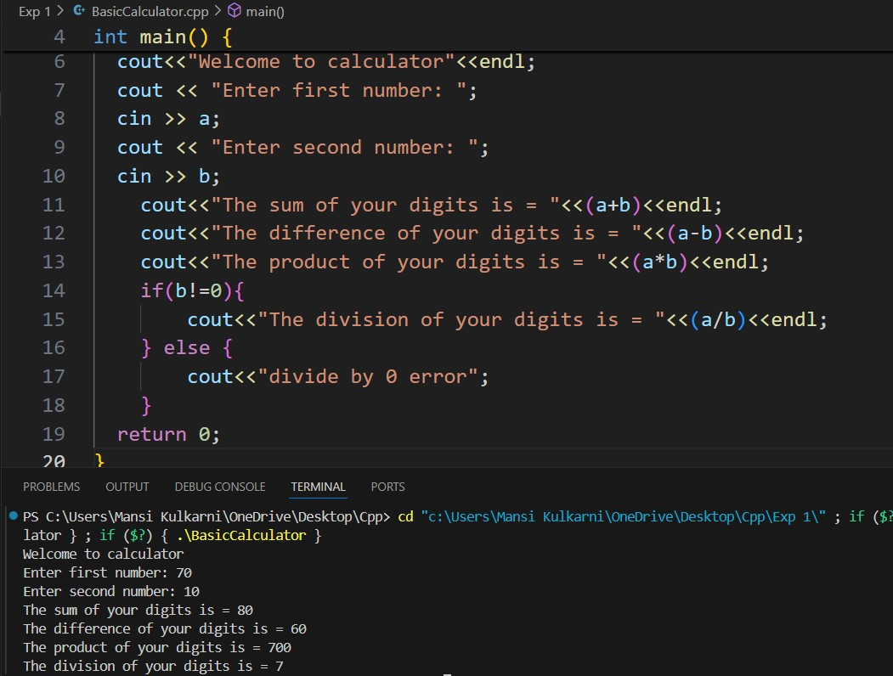

# Experiment 1
## Program 1
### Aim: 
To print "Hello World" using C++.
### Software used: 
Visual Studio Code
### Theory:
A simple "Hello World" program is the most basic program beginners write when learning a new programming language. It demonstrates the basic syntax including libraries, using the main() function, and printing output to the console. The main() function is the entry point of the program. We use the namespace std.
### Output:

### Conclusion:
We learned the syntax of how to display output in C++ and displayed "Hello World". 

## Program 2
### Aim:
To get input from the user and display it.
### Software used:
Visual Studio Code
### Theory:
To interact with the user, we use "in>>", which reads input from the user. By using cin, a program can prompt the user to enter data, such as numbers or strings. Once the data is input, it can be processed or displayed back using cout.
### Output:

### Conclusion:
We learned the syntax of how to take input from the user and display it in C++. 

## Program 3
### Aim:
To make a basic calculator that performs addition, subtraction, multiplication, and division operations and displays output. 
### Software used:
Visual Studio Code
### Theory:
A basic calculator program in C++ executes simple arithmetic operations such as addition, subtraction, multiplication, and division. The program prompts the user to input two numbers and carries out the requested arithmetic operations. The outcomes of these operations are exhibited to the user. This program explains essential concepts such as user input, basic arithmetic operations, and output.
### Output: 

### Conclusion: 
We learned how to perform simple mathematical operations in C++ and built a basic calculator that displayed the output. 
